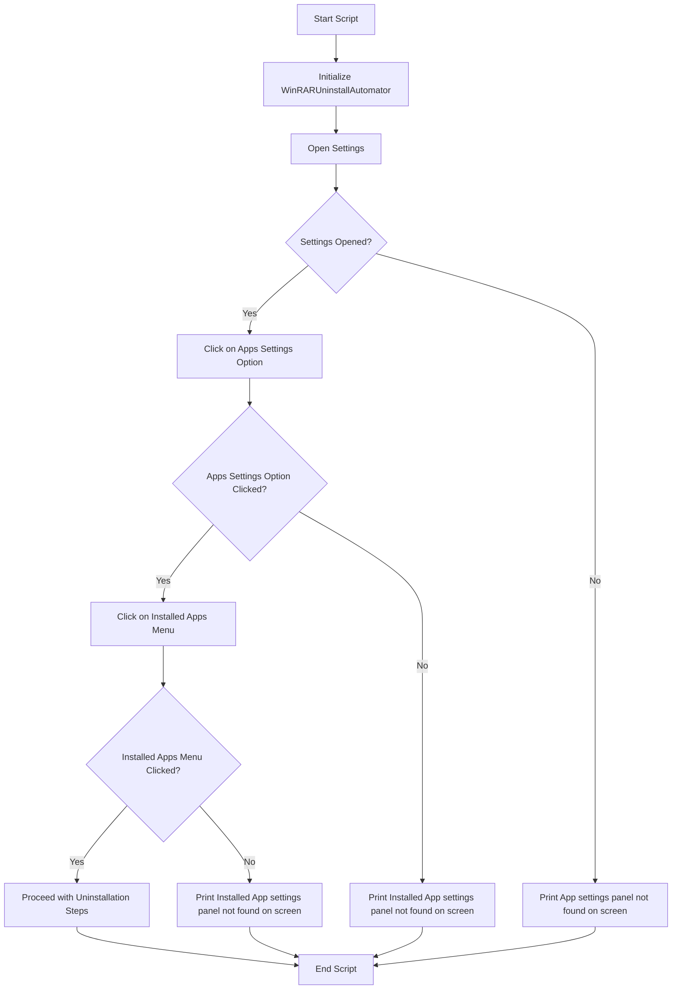

# WinRAR Uninstall Automator

This script automates the uninstallation of WinRAR on a Windows machine using the `pyautogui` library for GUI automation. It opens the Windows Settings, navigates to the Apps section, and searches for the WinRAR application to uninstall it.

## Prerequisites

- Python 3.x
- `pyautogui` library
- `opencv-python` library (for image recognition)
- Screenshots of the necessary UI elements saved in the `img/WinRAR` directory
- `pillow` python library

## Installation

### **Clone the repository**:
```sh
git clone https://github.com/your-repo/your-project.git
cd your-project
```

### **Create and activate a virtual environment**:
```sh
python3 -m venv venv
source venv/bin/activate  # On Windows use `venv\Scripts\activate`
```

### **Install the required packages**:
```sh
pip install pyautogui opencv-python pillow
```

### **Ensure the necessary screenshots are available**:
* `settings-apps-menu.png`: Screenshot of the Apps settings menu in Windows Settings.


* `installed-apps-menu.png`: Screenshot of the Installed Apps menu in Windows Settings.


## Workflow


### Explanation

- **A**: Start the script.
- **B**: Initialize the `WinRARUninstallAutomator` class.
- **C**: Open the Windows Settings.
- **D**: Check if the Settings window opened successfully.
  - **Yes**: Proceed to click on the Apps settings option.
  - **No**: Print "App settings panel not found on screen."
- **E**: Click on the Apps settings option.
- **G**: Check if the Apps settings option was clicked successfully.
  - **Yes**: Proceed to click on the Installed Apps menu.
  - **No**: Print "Installed App settings panel not found on screen."
- **H**: Click on the Installed Apps menu.
- **J**: Check if the Installed Apps menu was clicked successfully.
  - **Yes**: Proceed with the uninstallation steps.
  - **No**: Print "Installed App settings panel not found on screen."
- **K**: Proceed with the uninstallation steps (not detailed in the provided code).
- **M**: End the script.